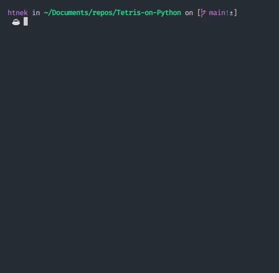

<h1 align="center"> Tetris no terminaaaal!</h1>

<p align="center">


</p>

## Descrição 📎

<p>
Não tem muito o que falar, é o tetris que você já conhece só que no terminal do linux! O jogo é completamente feito com caracteres de texto(unicode) e respodende a eventos de teclado. Foi tudo escrito em python🐍.

## Requisitos ❗

-   Git
-   Python 3.8+
-   Pip 20
-   Ubuntu

_OBS.:_ **O código pode facilmente rodar em outros sistemas**, porém só testei em meu ambiente, logo, não posso garantir nenhuma compatibilidade

## Como baixar e rodar 🚀

-   Primeiramente é necessário baixar o código fonte do repositório:

```bash
git clone https://github.com/LuigiVanin/Tetris-on-Python.git
```

-   Após isso é necessário instalar as bibliotecas com sudo(!). O sudo é necessário, pois a biblioteca keyboard precisa de acesso máximo para conseguir captar os eventos de teclado(😔).

```bash
sudo pip3 install -r requirements.txt
```

-   Com as bibliotecas baixadas agora podemos aproveitar do jogo. Basta rodar o script main com sudo!

```bash
sudo python3 main.py
```

-   Aproveite a gameplay🚀🚀🚀

## Como Jogar 🎮

-   Movimentação:

    -   Esquerda → **A**
    -   Direita → **D**
    -   Baixo → **S**
    -   Cima → **W**

-   Rotação:

    -   Horário → **K**
    -   Anti-Horário → **J**

-   Extra:
    -   Encerrar o Jogo → **Ctr+Z**

## Como funciona ❓

Para fazer o Tetris funcionar é utilizado o espaço vazio com uma calaração diferente para que seja possível representar blocos e o fundo, a realização da curtomização das cores se usa dos código ANSI de cores([Link](https://raccoon.ninja/pt/dev-pt/tabela-de-cores-ansi-python/)).

A atualização da tela, na verdade, não é atualização dos pixels em sí, na verdade o que o código faz é printar um novo tabuleiro abaixo do anterior, porém com muito espaço entre eles, dando a impressão de uma nova tela. Há melhores maneiras de fazer isso? Sim, como por exemplo utilizando a biblioteca nativa do python [curses](https://pypi.org/project/windows-curses/), mas optei por uma implementação mais "bruta" usando prints rsrsrs.

Para gerar o tabuleiro utilizei a famosa lib numpy, pois gosto do sistema de arrays multidimensionais, sendo assim mais fácil de trabalhar com matrizes.

## Ferramentas Utilizadas 🛠️

<br>

<p align="center">
    
    
    
</p>

## Outras Ferramentas 📦

-   [Keyboard](https://pypi.org/project/keyboard/).

## Entre em contato 📞

<br>

<p align="center">
<a href="https://www.linkedin.com/in/luis-felipe-vanin-martins-5a5b38215">

</a>
<a href="mailto:luisfvanin2@gmail.com">

</a>
</p>
